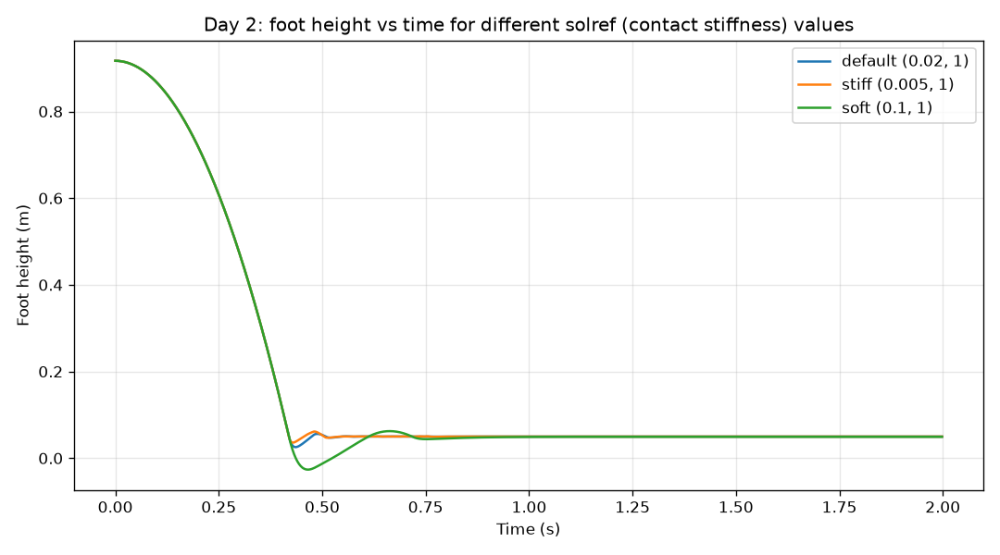
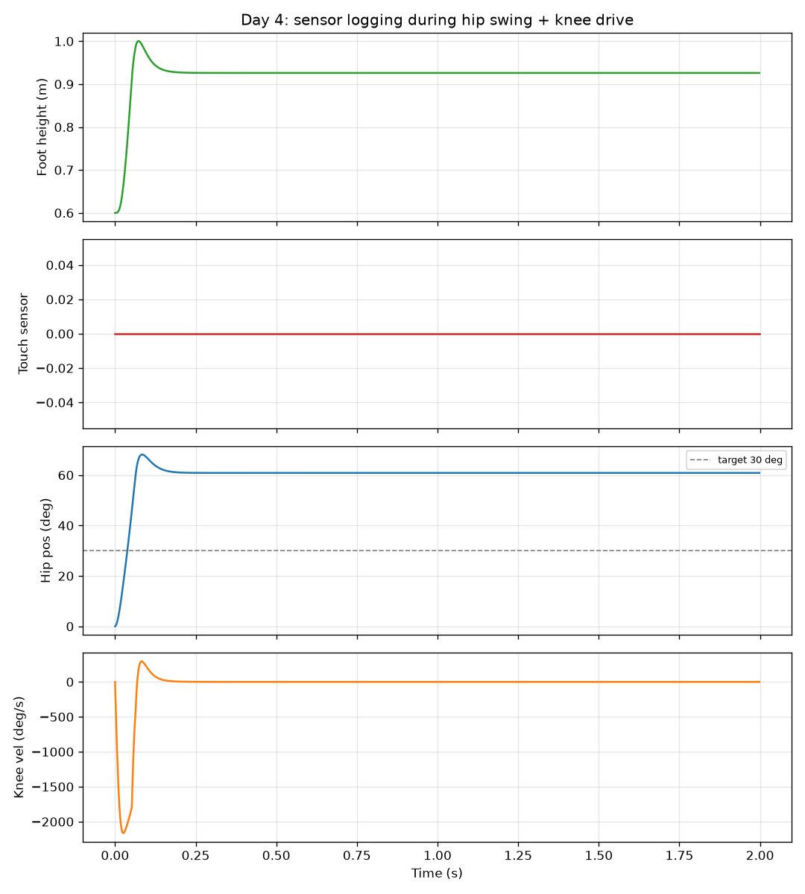

# MuJoCo Contact & Actuator Playground

A hands-on MuJoCo project exploring contact physics, actuator types, and sensors
using a hand-written 2-link leg model, built from raw MJCF (not converted from
another format). Part of a portfolio series preparing for robotics simulation
engineering roles.

## What this demonstrates
- Writing MJCF from scratch: bodies, joints, geoms, sites
- Tuning contact solver parameters (`solref`) and observing the effect on
  ground contact behavior
- Implementing and comparing position and velocity actuators
- Adding and logging touch, joint position, and joint velocity sensors
- Debugging real physics/simulation issues, not just following a tutorial
 ## Why two model files
`simple_leg.xml` and `simple_leg_freefall.xml` differ in one thing: whether the
base body has a `<freejoint/>`. A free-floating base is necessary to test falling
and ground contact (Days 1–2), but during actuator testing (Days 3–4) an
unconstrained floating base absorbed the actuators' reaction torques and flung
the whole model across the scene — a real instance of the general robotics
problem where a floating-base robot can only push against the world through its
feet, and reaction forces have to go somewhere. Fixing the base isolates
actuator behavior from that dynamic, which is what these tests need.

## Day 1 — Model construction
Built a 2-link leg (base → hip hinge → thigh → knee hinge → shin → foot) from
raw MJCF. Confirmed it falls under gravity and settles under contact.

Bugs found along the way:
- A body with only a hinge joint can't fall — it can only rotate around a fixed
  pivot. A `<freejoint/>` is required for actual free motion, and it must be the
  only joint on its body.
- MuJoCo requires an explicit `size` on every geom; there's no default.
- Model proportions (e.g. foot radius vs. limb thickness) are the modeler's
  responsibility — MuJoCo won't flag physically implausible dimensions.

## Day 2 — Contact tuning
Compared three `solref` (contact stiffness/damping) settings by dropping the
same bent-leg pose onto the floor and logging foot height over time.

| Setting | Min height (m) | Interpretation |
|---|---|---|
| Stiff (0.005, 1) | 0.0360 | Barely sinks — fast, rigid contact reaction |
| Default (0.02, 1) | 0.0256 | Moderate sink before recovering |
| Soft (0.1, 1) | -0.0264 | Visibly sinks below the floor before recovering |

All three converge to the same resting height (~0.05m, the foot's radius),
confirming the difference is purely in the transient contact response, not the
final rest state.

## Day 3 — Actuators
Implemented and tested position (`kp`), velocity (`kv`), and motor (torque)
actuators. Key findings:
- Position actuators pull toward a target angle proportionally to the error;
  velocity actuators hold a target speed with no destination at all.
- An active actuator on an undamped joint can go numerically unstable (NaN) —
  joint damping is a requirement, not an optional detail.
- An unconstrained floating base absorbs actuator reaction torques and can be
  flung across the scene by them (see "Why two model files" above).
- Joints in a kinematic chain are not independent: a joint saturated against
  its own range limit transmits force through the chain and can drag a
  neighboring joint off its own separately-commanded target.

## Day 4 — Sensors
Added touch, joint position, and joint velocity sensors, then logged all three
alongside foot height during an actuated motion.

- Hip position sensor correctly tracked the joint, though the hip settled at
  ~61° rather than the 30° target — a direct consequence of the Day 3
  chain-coupling finding (the knee, jammed at its limit, pulled the hip off
  target).
- Knee velocity sensor showed a sharp spike (~-2100°/s) as the knee slammed
  into its limit, then dropped to ~0 — a quantified view of a hard joint stop.
- Touch sensor read 0.0 throughout. This is correct given the setup: the fixed
  base and leg length in this configuration mean the foot's reachable range
  doesn't include the floor. This is a modeling constraint of this particular
  test, not a sensor malfunction — noted here rather than hidden, since
  recognizing which result is a limitation vs. a bug is part of the exercise.

## What I'd build on next
- Reconnect a floating base with a proper foot/ground friction setup capable of
  reacting against actuator torques without flinging, closer to a real legged
  robot's grounded stance
- Extend the touch sensor test to a configuration where contact is actually
  reachable, to validate the sensor against a real contact event
- Use this as the base model for Project 2 (URDF → MJCF → USD conversion)
